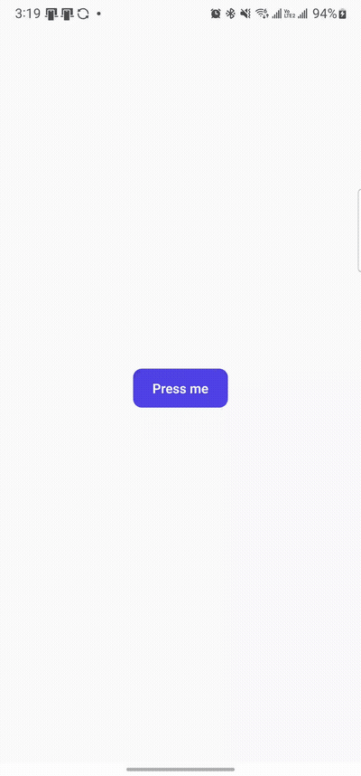
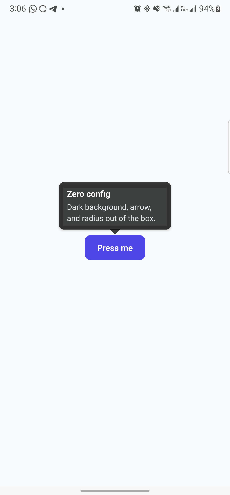
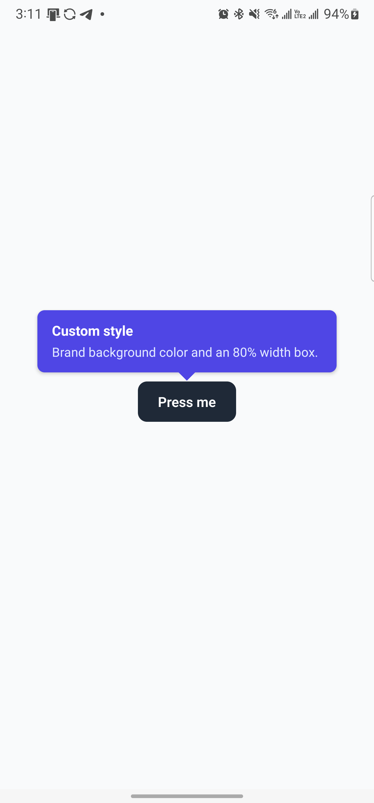
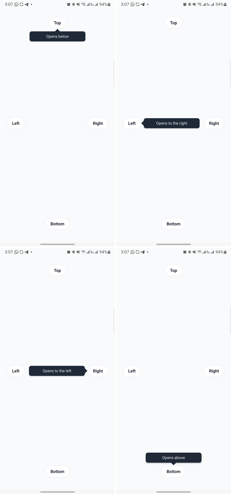
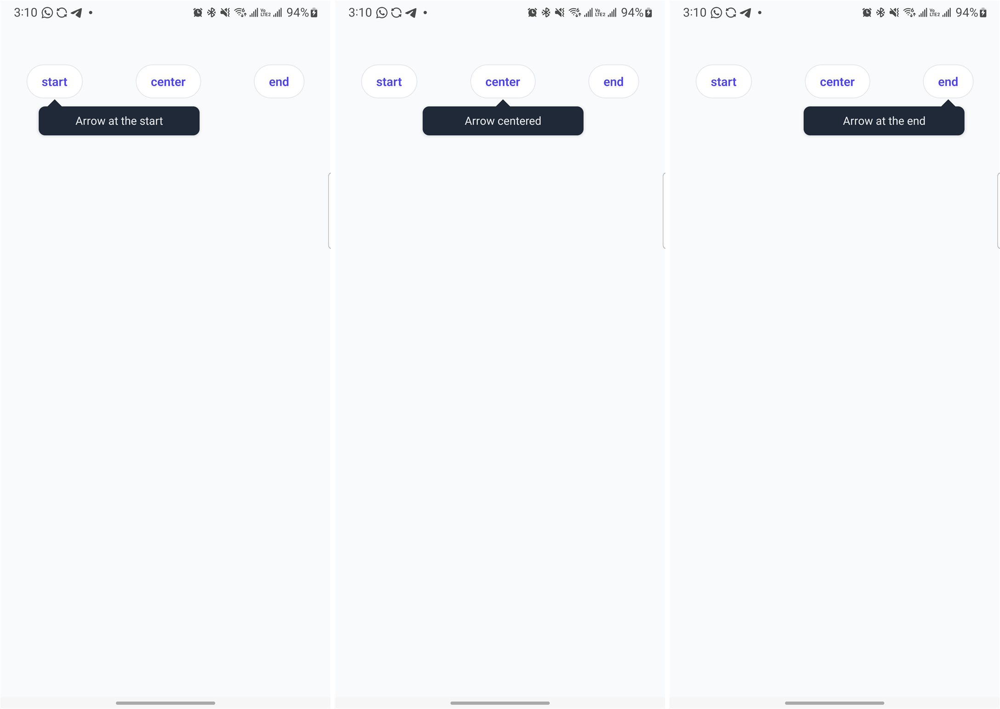
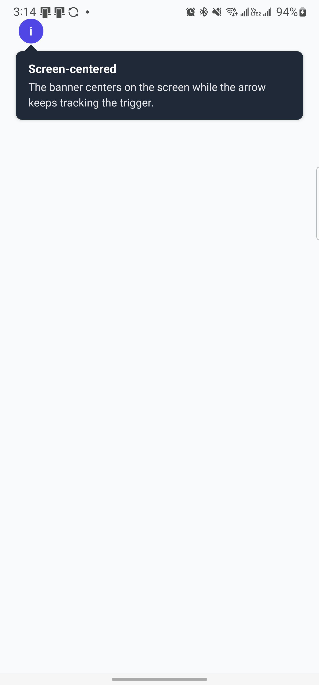
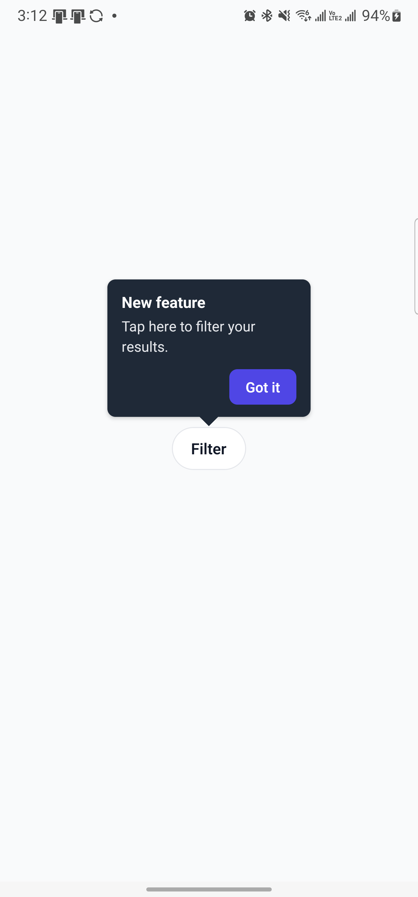
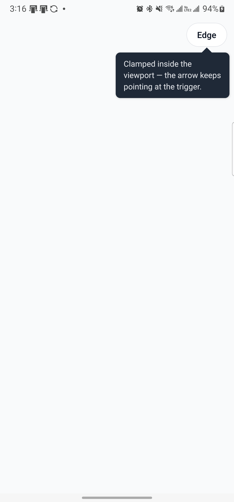

# @anb98/rn-tooltip

[](https://www.npmjs.com/package/@anb98/rn-tooltip)
[](LICENSE)
[](src/index.ts)

A tooltip for React Native with automatic position selection, viewport clamping, and an arrow that tracks the trigger. No native code, no runtime dependencies.

<p align="center">
  
</p>

## Quick path

1. Install:

   ```sh
   npm install @anb98/rn-tooltip
   # or
   yarn add @anb98/rn-tooltip
   # or
   pnpm add @anb98/rn-tooltip
   ```

   Peer dependencies: `react >=18.0.0`, `react-native >=0.72.0`.

2. Use it:

   ```tsx
   import { Tooltip } from "@anb98/rn-tooltip";
   import { Text } from "react-native";

   function Example() {
     return (
       <Tooltip
         content={
           <Text style={{ color: "white" }}>
             Dark background, arrow, and radius out of the box.
           </Text>
         }
       >
         <Text>Press me</Text>
       </Tooltip>
     );
   }
   ```

3. Verify: pressing the trigger opens a modal tooltip near it; pressing outside the tooltip (or the Android back button) closes it.



[Full runnable example](examples/Default.tsx)

## Props

| Prop              | Type                                                         | Default              | Description                                                                                               |
| ----------------- | ------------------------------------------------------------ | -------------------- | --------------------------------------------------------------------------------------------------------- |
| `content`         | `ReactNode`                                                  | required             | Tooltip body, rendered inside the modal box.                                                              |
| `children`        | `ReactNode`                                                  | required             | The pressable trigger content.                                                                            |
| `width`           | `number \| \`${number}%\``                                   | `200`                | Fixed pixel width or a percentage of the screen width.                                                    |
| `backgroundColor` | `string`                                                     | `'rgba(0,0,0,0.75)'` | Box and arrow fill color.                                                                                 |
| `position`        | `TooltipPosition` (`'top' \| 'bottom' \| 'left' \| 'right'`) | auto                 | Forces a side; when omitted the side with the most room is chosen.                                        |
| `arrowAlignment`  | `ArrowAlignment` (`'start' \| 'center' \| 'end'`)            | `'center'`           | Where the arrow (and box) align along the cross axis relative to the trigger.                             |
| `centerBy`        | `'tooltip' \| 'screen'`                                      | `'tooltip'`          | Whether the box centers on the trigger or on the screen along the cross axis.                             |
| `offset`          | `{ x?: number; y?: number }`                                 | `undefined`          | Extra gap between trigger and box. Positive always pushes the box farther away; negative pulls it closer. |
| `onChange`        | `(visible: boolean) => void`                                 | `undefined`          | Called whenever the tooltip opens or closes.                                                              |

`TooltipRef` (via `ref`):

| Method    | Description                                                        |
| --------- | ------------------------------------------------------------------ |
| `open()`  | Opens the tooltip programmatically, same as pressing the trigger.  |
| `close()` | Closes the tooltip programmatically, same as pressing the overlay. |

```tsx
// From examples/CustomStyle.tsx — styles omitted, see the full file
<Tooltip
  backgroundColor="#4F46E5"
  width="80%"
  content={
    <View style={styles.content}>
      <Text style={styles.title}>Custom style</Text>
      <Text style={styles.body}>
        Brand background color and an 80% width box.
      </Text>
    </View>
  }
>
  <View style={styles.button}>
    <Text style={styles.buttonText}>Press me</Text>
  </View>
</Tooltip>
```



[Full runnable example](examples/CustomStyle.tsx)

## Advanced examples

**Explicit position**

```tsx
// From examples/Positions.tsx — styles omitted, see the full file
<Tooltip
  content={<Text style={styles.tooltipBody}>Opens below</Text>}
  position="bottom"
  backgroundColor="#1F2937"
>
  <View style={styles.chip}>
    <Text style={styles.chipText}>Top</Text>
  </View>
</Tooltip>
```



[Full runnable example](examples/Positions.tsx)

**Arrow alignment**

```tsx
// From examples/ArrowAlignments.tsx — styles omitted, see the full file
<Tooltip
  content={<Text style={styles.tooltipBody}>Arrow at the start</Text>}
  position="bottom"
  arrowAlignment="start"
  backgroundColor="#1F2937"
>
  <View style={styles.chip}>
    <Text style={styles.chipText}>start</Text>
  </View>
</Tooltip>
```



[Full runnable example](examples/ArrowAlignments.tsx)

**Center by screen**

```tsx
// From examples/CenterByScreen.tsx — styles omitted, see the full file
<Tooltip
  width="90%"
  centerBy="screen"
  position="bottom"
  backgroundColor="#1F2937"
  content={
    <View style={styles.content}>
      <Text style={styles.title}>Screen-centered</Text>
      <Text style={styles.body}>
        The banner centers on the screen while the arrow keeps tracking the
        trigger.
      </Text>
    </View>
  }
>
  <View style={styles.icon}>
    <Text style={styles.iconText}>i</Text>
  </View>
</Tooltip>
```



[Full runnable example](examples/CenterByScreen.tsx)

**Offset**

```tsx
<Tooltip
  content={<Text>10px farther from the trigger</Text>}
  position="top"
  offset={{ y: 10 }}
>
  <Text>Trigger</Text>
</Tooltip>
```

**Imperative ref**

```tsx
// From examples/RichContent.tsx — styles omitted, see the full file
import { useRef } from 'react'
import { Tooltip, TooltipRef } from '@anb98/rn-tooltip'

const tooltipRef = useRef<TooltipRef>(null)

<Tooltip
  ref={tooltipRef}
  backgroundColor="#1F2937"
  content={
    <View style={styles.content}>
      <Text style={styles.title}>New feature</Text>
      <Text style={styles.body}>Tap here to filter your results.</Text>
      <Pressable style={styles.dismiss} onPress={() => tooltipRef.current?.close()}>
        <Text style={styles.dismissText}>Got it</Text>
      </Pressable>
    </View>
  }
>
  <View style={styles.chip}>
    <Text style={styles.chipText}>Filter</Text>
  </View>
</Tooltip>
```



[Full runnable example](examples/RichContent.tsx)

## Viewport clamping

When the trigger sits near a screen edge, the box clamps inside the viewport instead of overflowing, and the arrow shifts to keep pointing at the trigger.



[Full runnable example](examples/EdgeClamping.tsx)

## License

MIT © 2026 Abdiel Martinez
